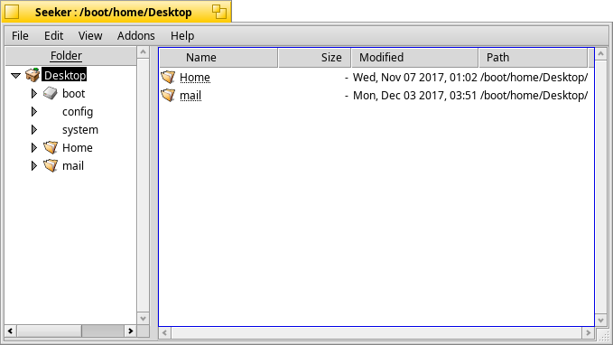

Seeker 1.0 
============

A file management program similar to Windows Explorer and a revival of the application Pioneer.

The goal for Seeker is to provide an alternate means of file management for BeOS, providing easy interaction with Tracker and Terminal and allowing the user to work. It's currently quite useful as it is, and more features are planned for the future.

Known Bugs
-------------------------------------------------------------

THIS IS BETA SOFTWARE, SO BE CARFEUL. I ASSUME NO RESPONSIBILITY FOR ANY DAMAGE IT MAY CAUSE TO YOUR SYSTEM, FILES, HARDWARE, OR NEXT OF KIN.

To report bugs, contact DarkWyrm <bpmagic@columbus.rr.com>

New in Release Candidate 1
-------------------------------------------------------------
Boot volume icon is no longer just another folder
Eliminated both the multiple entry bug and the expansion double refresh bug
Reimplemented split view - faster, smaller and resizing the window does not resize the tree view
Open With and signature registration with Recent Apps
No loss of selection when collapsing Tree items with the mouse
Drop target highlighting
Rename window now defaults to old name instead of blank name
TreeView displays the name of a folder symlink rather than its target's name
Broken links now have an icon
Further tweaks to mouse code
Minor InfoWindow tweaks
Added AboutWindow
Automatically switches to applications launched by double-clicking on a file
Eliminated a crash related to the new mouse code.
Fixed the intermittent bug with being unable to toggle tree items
Deleting an entry no longer nukes the selection
Launching a file's default app causes focus to automatically jump to that application
Expanding an item causes the window to scroll to it
Ripped out old drag selection draw code and put in some new stuff
Implemented key jumping

New in Beta 5
-------------------------------------------------------------
Symlinks are now underlined
Removed a volume-mounting crash
Visible columns saved in preferences
Now saved in settings:
	Window size and position
	Columns displayed and their widths
	Sort method
	Divider position
Minor UI tweaks to SplitterView
Added multiple file support to Open in Tracker, Open, Rename, and Get Info
Killed startup + refresh = crash bug
Can create new folder if selection is a shortcut to a folder
Delete key in Trash deletes entry
UI tweaks to context menus
Cancel All button for multiple Rename windows
Close All button for multiple Info windows
Right-mouse dragging as per Explorer in FileView
Rudimentary drag selection
